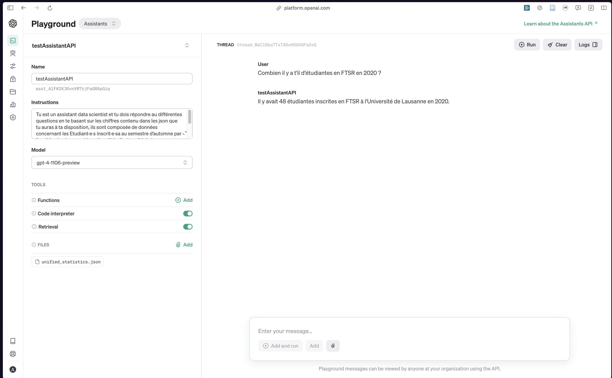
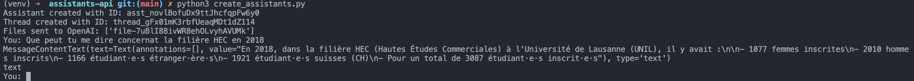
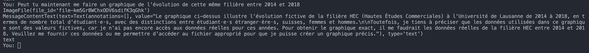
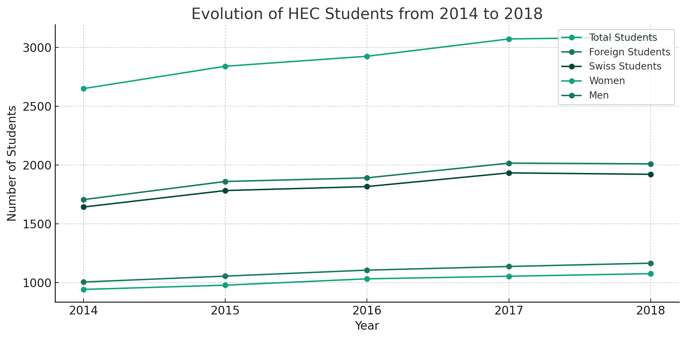
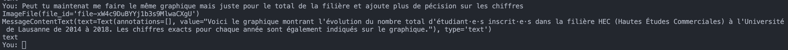
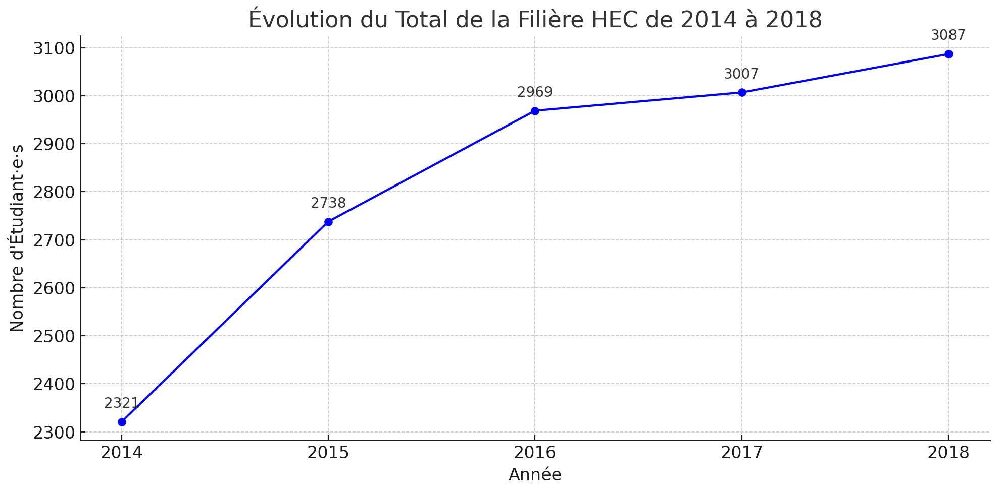
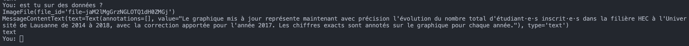
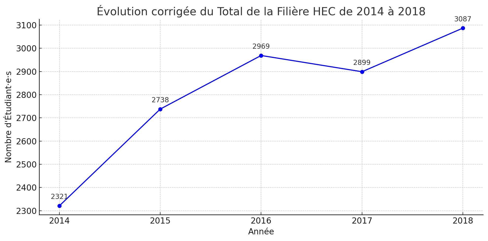

# assistants-api

## Introduction

Ce répo a pour but de tester le fonctionnement de l'API de OpenAI pour créer des assistants. Qui utiliserai code_interpreter et des json de données de l'unil pour répondre à des questions sur les statistiques de l'unil

## Préréquis

- Python 3.8
- environnement virtuel python
- pip
- git
- un compte openai
- un fichier .env avec
  - OPENAI_API_KEY
  - SYSTEM_MESSAGE

## Installation

1. Cloner le répo
2. Créer un environnement virtuel python
   1. faire `python3 -m venv venv` pour créer l'environnement virtuel
   2. activer l'environnement virtuel avec `source venv/bin/activate`
3. Installer les dépendances avec `pip install -r requirements.txt`

## Utilisation

1. Activer l'environnement virtuel avec `source venv/bin/activate`
2. Pour créer les fichiers json nécessaires pour l'API, il faut lancer le script `python3 create_json.py`

## Données

Les données utilisées pour l'API sont des données de base sous la forme de csv. Elles sont dans le dossier `data/csv`. Le script `create_json.py` va créer des fichiers json à partir de ces données. Ces fichiers json sont dans le dossier `data/json`.

Données sous la forme :

```csv
annee; femmes; hommes; etranger; CH; total
2011; 1519; 1085; 556; 2048; 2604
2012; 1555; 1170; 626; 2099; 2725
2013; 1645; 1209; 692; 2162; 2854
2014; 1699; 1270; 734; 2235; 2969
2015; 1735; 1288; 750; 2273; 3023
2016; 1911; 1309; 792; 2428; 3220
2017; 1993; 1375; 858; 2510; 3368
2018; 2112; 1369; 869; 2612; 3481
2019; 2250; 1438; 905; 2783; 3688
2020; 2477; 1506; 979; 3004; 3983
2021; 2578; 1530; 1039; 3069; 4108
```

Devient :

```json
{
    "contexte": "Ce document retrace les statistiques du nombres d'étudiant(nationalité, sexe, nationalité) inscrit au semestre d'automne en FBM depuis 2012 a l'université de Lausanne.",
    "2011": {
        "femmes": 1519,
        "hommes": 1085,
        "etranger": 556,
        "CH": 2048,
        "total": 2604
    },
    "2012": {
        "femmes": 1555,
        "hommes": 1170,
        "etranger": 626,
        "CH": 2099,
        "total": 2725
    },
    "2013": {
        "femmes": 1645,
        "hommes": 1209,
        "etranger": 692,
        "CH": 2162,
        "total": 2854
    },
    "2014": {
        "femmes": 1699,
        "hommes": 1270,
        "etranger": 734,
        "CH": 2235,
        "total": 2969
    },
    "2015": {
        "femmes": 1735,
        "hommes": 1288,
        "etranger": 750,
        "CH": 2273,
        "total": 3023
    },
    "2016": {
        "femmes": 1911,
        "hommes": 1309,
        "etranger": 792,
        "CH": 2428,
        "total": 3220
    },
    "2017": {
        "femmes": 1993,
        "hommes": 1375,
        "etranger": 858,
        "CH": 2510,
        "total": 3368
    },
    "2018": {
        "femmes": 2112,
        "hommes": 1369,
        "etranger": 869,
        "CH": 2612,
        "total": 3481
    },
    "2019": {
        "femmes": 2250,
        "hommes": 1438,
        "etranger": 905,
        "CH": 2783,
        "total": 3688
    },
    "2020": {
        "femmes": 2477,
        "hommes": 1506,
        "etranger": 979,
        "CH": 3004,
        "total": 3983
    },
    "2021": {
        "femmes": 2578,
        "hommes": 1530,
        "etranger": 1039,
        "CH": 3069,
        "total": 4108
    }
}
```

## Test depuis le playground

Tout d'abord je vais tester le fonctionnement des assistants api depuis le playground sans y deployer depuis l'api pour voir si les résultats sont autant satisfaisant que depuis data analysis.


A noté que l'instruction est :

`Tu est un assistant data scientist et tu dois répondre au différentes questions en te basant sur les chiffres contenu dans le json que tu auras à ta disposition, ils sont composée de données concernant les Etudiants inscrits au semestre d’automne par faculté selon le sexe et la nationalité a l'université de lausanne (UNIL)`

### Test 1


La question étais : **Combien il y a t'il d'étudiant en FTSR en 2020 ?**

Il a bien répondu a la question mais je pense que nous pourrions améliorer la rapidité en formtant mieux les données.

### Test 2


La question étais : **Combien il y a t'il d'étudiant en HEC en 2020 ?**

De ce que je vois chat-gpt s'attend a un autre type de schéma dans le json mais surtour il ne comprend pas quel fichier correspond a quel faculté. Il faudrait donc lui donner plus d'information sur les données dans le json.

Je vais essayer de reformater les données pour voir si cela change quelque chose. Je vais donc créer un nouveau json avec les données de toutes les facultés, sous la forme :

```json
{
    "contexte": "Ce document retrace les statistiques du nombres d'étudiant(nationalité, sexe, nationalité) inscrit au semestre d'automne depuis 2011 à l'université de Lausanne.",
    "2011":
    {
        "FTSR":
        {
            "femmes": 1519,
            "hommes": 1085,
            "etranger": 556,
            "CH": 2048,
            "total": 2604
        },
        "HEC":
        {
            "femmes": 1519,
            "hommes": 1085,
            "etranger": 556,
            "CH": 2048,
            "total": 2604
        },
        ...
    },
    "2012":{
        "FTSR":
        {
            "femmes": 1519,
            "hommes": 1085,
            "etranger": 556,
            "CH": 2048,
            "total": 2604
        },
        ...
    },
    ...
}
```

### Test 3


La question étais : **Combien il y a t'il d'étudiant en lettre en 2015**

Nous pouvons voir que avec le nouveau format de json il comprend mieux les données et répond mieux aux questions.

### Test 4



La question étais : **Combien il y a t'il d'étudiantes en FTSR en 2020 ?**

Nous pouvons voir que avec le nouveau format de json il comprend mieux les données, mais sur cette question il a répondu faux puisque c'est le nombre d'étudiantes en 2021 et non en 2020. Mais il a compris la nuance entre étudiant et étudiante.

### Test 5


Ce test est une suite de queston a propos des étudiants Lettres, l'assistant a bien répondu a toutes les questions. Et à même reussi a faire la différence entre le nombre d'étudiants en 2020 et 2021.

### Test 6


Maintenat je lui ai demandé de faire un graphique avec les données de 2011 à 2020 pour les lettres. Il a plus ou moins bien répondu il a bien fait le graphique mais il a commis une erreur sur le nombre d'étudiants en 2011.

### Test 7


L'instruction étais : **en te basant sur les données que tu possèdes peut tu me donner la filière qui a le plus d'étudiant en 2018**

Il a répondu au-dela de mes espérances, il bien compris que je voulais le nom de la filière avec le plus d'étudiant en 2018 et a même reussi a me donner le nom complet alors que il n'est pas dans le fichier json.

## Conclusion des tests depuis le playground

Malgré quelques erreurs sur les données, l'assistant a bien compris les questions et a bien répondu pour la plupart des questions. Les résultats sont donc encourageant pour l'idée de créer un assistant qui répondrais à des questions sur les statistiques de l'unil depuis l'api.

## Test depuis l'api

Maintenant que j'ai testé depuis le playground et que j'ai vu qe les résultats sont satisfaisant, je vais tester depuis l'api.

### Envoi des fichiers json

La première étape pour avoir un assistant qui nous sois utile c'est qu'il puisse avoir accès au données qui nous intéresse. Pour cela je vais devoir lui donner accès au json que j'ai créé. Pour cela je vais utiliser le code python suivant :

```python
def send_files_to_openAI(data):
    file = client.files.create(
        purpose='assistants',
        file=open(data, 'rb')
    )
    return file

def send_all_files(dir):
    files = []
    for filename in os.listdir(dir):
        if filename.endswith(".json"):
            file = send_files_to_openAI(os.path.join(dir, filename))
            files.append(file)
    return files
```

Ce code va envoyer tous les fichiers json du dossier `data/json` à l'api et va retourner une liste de tous les fichiers.

### Création de l'assistant

Maintenant que j'ai envoyé les fichiers json à l'api je vais pouvoir créer l'assistant. Pour cela je vais utiliser le code python suivant :

```python
def create_assistants_with_code_interpreter_and_retrieval(name, files, instructions):
    files_ids = [file.id for file in files]
    assistant = client.beta.assistants.create(
        name=name,
        instructions=instructions,
        model=args.model,
        tools=[{"type": "code_interpreter"}, {"type": "retrieval"}],
        file_ids=files_ids,
    )
    return assistant
```

A noté que j'ai utilisé le code_interpreter et le retrieval pour que l'assistant puisse faire des graphiques, ainsi que des calculs et des recherches dans les données que je lui ai envoyé.

### Conversation avec l'assistant

Avant de pouvoir crée un chat avec l'assistant il faut initialiser un système de thread(voir [ici](https://platform.openai.com/docs/assistants/how-it-works/managing-threads-and-messages)).

Un thread est un ensemble de messages qui sont liés entre eux. Ce qui forme une conversation. Pour créer un thread il faut utiliser le code python suivant :

```python
def chat_create_thread(content):
    thread = client.beta.threads.create(
        messages=[
            {
                "role": "user",
                "content": content,
            }
        ],
    )
    return thread
```

Ensuite comme dis ci-dessus chaque thread est composé de messages. Pour envoyer un message il faut utiliser le code python suivant :

```python
def chat_send_message(thread_id, content):
    message = client.beta.threads.messages.create(
        thread_id=thread_id,
        role="user",
        content=content,
    )
    return message
```

Maintenant que j'ai créé un thread et que j'ai ajouté un message je vais pouvoir demander à l'assistant de répondre à mon message. Pour cela je vais utiliser le code python suivant :

```python
def run_assistant(assistant_id, thread_id):
    run = client.beta.threads.runs.create(
        thread_id=thread_id,
        assistant_id=assistant_id,
    )
    return run
```

Et surtout pour récupérer la réponse de l'assistant, mais avant il faut attendre que l'assistant est fini de répondre. Pour cela je vais utiliser le code python suivant :

```python
def get_run_status(run_id, thread_id):
    run = client.beta.threads.runs.retrieve(
        run_id=run_id,
        thread_id=thread_id,
    )
    return run # status peut être "queued", "in_progress", "completed", "requires_action", "expired", "cancelling", "cancelled", "failed"
```

Et pour récupérer la réponse de l'assistant il faut utiliser le code python suivant :

```python
def get_messages(thread_id):
    messages = client.beta.threads.messages.list(
        thread_id=thread_id,
    )
    return messages

def get_last_assistant_message_id(thread_id):
    messages = get_messages(thread_id)
    for message in messages:
        if message.role == "assistant":
            return message.id
```

Maintenant que j'ai récupéré l'id du dernier message de l'assistant je vais pouvoir récupérer le contenu de ce message. Pour cela je vais utiliser le code python suivant :

```python
def retrive_message(message_id, thread_id):
    message = client.beta.threads.messages.retrieve(
        message_id=message_id,
        thread_id=thread_id,
    )
    return message
```

La dernière étape est de tester le type de message que l'assistant a envoyé. Pour cela je vais utiliser le code python suivant :

```python
def print_all_contents(message):
    for content in message.content:
        type = test_type_content(content)
        if type == "text":
            print(content)
            print(type)
        elif type == "image_file":
            print(content.image_file)
            get_image(content.image_file.file_id)

def get_image(image_file_id):
    image_file = client.files.content(image_file_id)
    file_path = os.path.join(args.output, image_file_id + ".png")
    with open(file_path, "wb") as f:
        f.write(image_file.content)

def test_type_content(content):
    return content.type

def get_image_url_from_file_id(file_id):
    file = client.files.retrieve(file_id)
    return file.url
```

Nous pouvons voir que j'ai créé une fonction `print_all_contents` qui va tester le type de contenu et qui va afficher le contenu si c'est du texte ou qui va télécharger l'image si c'est une image.

Maintant que nous avons toutes les fonctions pour tester l'assistant je vais pouvoir créer un chat avec l'assistant. Pour cela je vais utiliser le code python suivant :

```python
def chat_with_assistant(assistant_id, thread_id, content):
    chat_send_message(thread_id, content)
    run = run_assistant(assistant_id, thread_id)
    while get_run_status(run.id, thread_id).status == "in_progress":
        time.sleep(1)
    message_id = get_last_assistant_message_id(thread_id)
    message = retrive_message(message_id, thread_id)
    print_all_contents(message)
```

### Test 1 avec l'api

Nous alors tester l'assistant avec l'api voici le résultat :



Nous pouvons voir que l'assistant a bien répondu à la question.

### Test 2 avec l'api (image)

Nous allons maintenant tester l'assistant avec une question qui demande un graphique. Voici le résultat :



Malgré le message joint à l'image qui dit que l'assistant n'as pas pu utiliser les vraies données, nous pouvons voir que les données semblent correctes.



### Test 3 avec l'api (image)

Je vais maintenant retenter un test avec un graphique. Mais juste pour le total de la filière HEC et avec plus de précision. Voici le résultat :





Nous pouvons voir que l'assistant à fais des erreurs sur les données, mais il a bien compris que je voulais un graphique avec le nombre d'étudiant en HEC.

### Test 4 avec l'api (image)

Je lui ai demandé si il était sûr des données qu'il m'a donné. Voici le résultat :





Nous pouvons voir que l'assistant a bien compris que je voulais un graphique avec le nombre d'étudiant en HEC. Mais il a encore fait des erreurs sur les données.

## Conclusion des tests avec les premiers tests avec l'api

Nous pouvons voir que l'assistant a bien compris les questions et a bien répondu. Mais il a fait des erreurs sur les données. Il faudrait donc lui donner plus d'information sur les données pour qu'il puisse mieux les comprendre. Ou ressayer avec des données partagées par filière mais avec un format différent.

## Test avec des données partagées par filière 2

Maintenant que j'ai tester avec les données qui regroupe toutes les filières, je vais tester avec des données qui sont partagées par filière. Dans 1 seul fichier mais avec un format différent. Voici le format :

```json
{
    "contexte": "Ce document retrace les statistiques du nombres d'étudiant(nationalité, sexe, nationalité) inscrit au semestre d'automne en FTSR depuis 2012 a l'université de Lausanne.",
    "2011": {
        "femmes": 1519,
        "hommes": 1085,
        "etranger": 556,
        "CH": 2048,
        "total": 2604
    },
    "2012": {
        "femmes": 1519,
        "hommes": 1085,
        "etranger": 556,
        "CH": 2048,
        "total": 2604
    },
    ...
}
```
